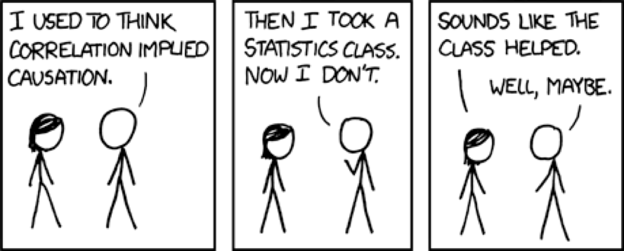
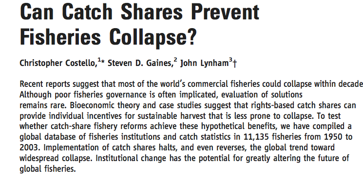

```{r global_options, include=FALSE, cache=F}
library(knitr)
knitr::opts_chunk$set(fig.path='Figs/', echo=FALSE, warning=FALSE, message=FALSE)
library(gridExtra)
library(ggplot2)
library(plyr)
library(dplyr)
library(tidyr)
library(broom)
library(coda)
library(ggmcmc)
library(LaplacesDemon)
library(foreach)
library(parallel)
library(stats4)
library(stargazer)
library(texreg)
load('PrmRegressions.Rdata')
load('Global Fishery Recovery Results.rdata')
```

## The Panel Regression Model

* Panel regression:
    * Fancy term for regression with time
    * Also called "longitudinal" data
    * Track objects of interest over time
    * E.g. Costello et al. 2008: Do catch shares work?

## Why a Panel Regression?

* Our goal was to get B~Bmsy~
* Only catch history and a bit of life history
* Threw out CatchMSY.... whoops
* Let the data speak for itself

## Advantages of Panel Data



## Advantages of Panel Data

* Can help with causation
* Focus is on trend rather than absolute number
* Fixed effects
    * Use degrees of freedom!
* Difference in difference
    * Wages etc.

## Costello et al. 2008

  

## Back to PRM

* Panel methods are for causation
* We don't actually care about that
* We just want a good fit
    * sort of....

## Why don't we care about Causation?


## Why don't we care about Causation?


* Umbrelas may be a great predictor
* Want more rain? Buy umbrellas!
* We can't attribute causality to coeeficcients
* But we can say whether they seem to reflect B/B~MSY~
* Basically astrology


##  PRM Methods

$$log(\frac{B}{B_{msy}})_{i,y} = \alpha + \beta{X_{i}} + \gamma{Y_{i,y}} + \epsilon_{s} + e_{i,y,s}$$

* Basic linear regression fit via OLS
    * Most other regression methods are basically trying correct the SEs
* Uses
    * Time
    * Catch
    * Life history

    
## Summary of the Data

```{r, summary data}

RamSummary <- RamData %>%
  group_by(IdOrig) %>%
  summarize(max.catch = max(Catch, na.rm = T), med.catch = median(Catch, na.rm = T), sd.catch = sd(Catch, na.rm = T), 
           med.b =  median(BvBmsy, na.rm = T), med.f = median(FvFmsy, na.rm = T), mean.k = mean(VonBertK, na.rm = T), mean.temp = mean(Temp, na.rm = T), sp.group = unique(SpeciesCatName), country = 
             unique(Country))

RamSummary$Dbase <- 'RAM'

FaoSummary <- FaoData %>%
  group_by(IdOrig) %>%
  summarize(max.catch = max(Catch, na.rm = T),med.catch = median(Catch, na.rm = T), sd.catch = sd(Catch, na.rm = T), 
           med.b =  median(BvBmsy, na.rm = T), med.f = median(FvFmsy, na.rm = T), mean.k = mean(VonBertK, na.rm = T), mean.temp = mean(Temp, na.rm = T), sp.group = unique(SpeciesCatName), country = 
             unique(Country))

FaoSummary$Dbase <- 'FAO'

dat <- rbind(RamSummary,FaoSummary)

ggplot(dat, aes(log(max.catch), fill = Dbase)) + 
  geom_histogram() + 
  xlab('Log of Max Catch') + 
  ylab('Count')

```

## The Data

```{r}

ggplot(subset(RamData, Year >2006), aes(BvBmsy)) + 
  geom_histogram(fill = 'blue') + 
  geom_vline(aes(xintercept = 1))

```


## The Data

```{r}

ggplot(subset(RamData, Year >2006), aes(FvFmsy)) + 
  geom_histogram(fill = 'blue') + 
  geom_vline(aes(xintercept = 1))

```

## The Data

```{r}

ggplot(dat, aes(sp.group, fill = Dbase)) + 
  geom_bar() + 
  coord_flip() + 
  ylab('Count')
```

## The Models

```{r,echo=F,results='asis',message=F}

stargazer(RealModels$M1, title = 'Model 1',type = 'html',font.size = 'tiny', flip = T, digits = 2)

```

## The Models

In log space
```{r}

modelfunc <- function(m,models)
{
eval(parse(text = paste('model = augment(RealModels$',models[m],')', sep = '')))
  
  model$model <- models[m]
  
  return(model)
}       

models <- names(RealModels)

model.results <- lapply(1:length(models),modelfunc, models = models) %>% ldply()
                  
ggplot(subset(model.results, model != 'M7'), aes(LogBvBmsy, .fitted)) + 
  geom_point(fill = 'lightseagreen',alpha = 0.6, shape = 21) + 
  geom_smooth(method = 'lm', se = F) + 
  geom_abline(a = 0, b = 1) + 
  facet_wrap(~model) + 
  theme(text = element_text(size = 22)) + 
  xlab('Observed B/Bmsy') + 
ylab('Predicted B/Bmsy')

```

## The Models

Now exponentiated

```{r}
ggplot(subset(model.results, model != 'M7'), aes(exp(LogBvBmsy), exp(.fitted))) + 
  geom_point(fill = 'lightseagreen',alpha = 0.6, shape = 21) + 
  geom_smooth(method = 'lm', se = F) + 
  geom_abline(a = 0, b = 1) + 
  facet_wrap(~model) + 
  theme(text = element_text(size = 22)) + 
  xlab('Observed B/Bmsy') + 
ylab('Predicted B/Bmsy') 
```

## The Models

Residuals vs. predicted 

```{r}
ggplot(subset(model.results, model != 'M7'), aes((.fitted), .resid)) + 
  geom_point(fill = 'lightseagreen',alpha = 0.6, shape = 21) + 
  geom_smooth(method = 'lm', se = F) + 
  geom_hline(aes(yintercept = 0)) + 
  facet_wrap(~model) + 
  theme(text = element_text(size = 22)) + 
  xlab('Predicted log(B/Bmsy)') + 
ylab('Residuals')
```

## The Models

Residuals vs. exponentiated predicted values

```{r}
ggplot(subset(model.results, model != 'M7'), aes(exp(.fitted), .resid)) + 
  geom_point(fill = 'lightseagreen',alpha = 0.6, shape = 21) + 
  geom_smooth(method = 'lm', se = F) + 
  geom_hline(aes(yintercept = 0)) + 
  facet_wrap(~model) + 
  theme(text = element_text(size = 22)) + 
  xlab('Predicted B/Bmsy') + 
ylab('Residuals')
```

## The Models

Residuals over time

```{r exp plot}
ggplot(subset(model.results, model != 'M7'), aes((YearsBack), .resid)) + 
  geom_point(fill = 'lightseagreen',alpha = 0.6, shape = 21) + 
  geom_smooth(method = 'lm', se = F) + 
  geom_hline(aes(yintercept = 0)) + 
  facet_wrap(~model) + 
  theme(text = element_text(size = 22)) + 
  xlab('Year') + 
ylab('Residuals')
```

## The Models

```{r}

model.results %>%
  ungroup() %>%
  group_by(YearsBack, model) %>%
  summarize(mean.real = mean(LogBvBmsy), mean.predicted = mean(.fitted)) %>%
  ggplot(aes(YearsBack,mean.real)) + 
  geom_point(fill = 'lightseagreen',shape = 21, size = 2, alpha = 0.6) + 
  geom_line(aes(YearsBack, mean.predicted, color = 'Predicted')) + 
  scale_color_manual(name = element_blank(), values = 'black') + 
  facet_wrap(~model) + 
  theme(text = element_text(size = 22)) + 
  xlab('Years in the Past')  + 
  ylab('log(B/Bmsy)')

```

## Retransformation Bias

* Retransformation bias rears its head

```{r}

model.results %>%
  ungroup() %>%
  group_by(YearsBack, model) %>%
  summarize(mean.real = mean(exp(LogBvBmsy)), mean.predicted = mean(exp(.fitted)),samps = length(LogBvBmsy),corrected.mean = mean(exp(.fitted + (sd(.fitted)^2/2)))) %>%
  ggplot(aes(YearsBack,mean.real)) + 
  geom_point(fill = 'lightseagreen',shape = 21, size = 2, alpha = 0.6) + 
  geom_line(aes(YearsBack, mean.predicted, color = 'Predicted')) + 
  scale_color_manual(name = element_blank(), values = 'black') + 
  facet_wrap(~model) + 
  theme(text = element_text(size = 22)) + 
  xlab('Years in the Past')  + 
  ylab('B/Bmsy')

```

## Retransformation Bias

* Retransformation bias rears its head

```{r}

model.results %>%
  ungroup() %>%
  group_by(YearsBack, model) %>%
  summarize(mean.real = mean(exp(LogBvBmsy)), mean.predicted = mean(exp(.fitted)),samps = length(LogBvBmsy),corrected.mean = mean(exp(.fitted + (sd(.fitted)^2/2)))) %>%
  ggplot(aes(YearsBack,mean.real)) + 
  geom_point(fill = 'lightseagreen',shape = 21, size = 2, alpha = 0.6) + 
  geom_line(aes(YearsBack, corrected.mean, color = 'Predicted')) + 
  scale_color_manual(name = element_blank(), values = 'black') + 
  facet_wrap(~model) + 
  theme(text = element_text(size = 22)) + 
  xlab('Years in the Past')  + 
  ylab('B/Bmsy')

```

## Retransformation Bias

We have a few problems

* Means and medians are biased
* Errors...
    * are clusterted
    * heteroskedasticity
* Solutions
    * for the mean, correct by  smearing estimate $\sigma^2/2$
    * for the median...
    
## Retransformation Bias

* denote $log(B/B_{MSY}) = x_{i,t}\beta + e_{i,t}$ ~ $N(0,\sigma_{i,t}^{2})$

    * allows for heterskedasticity 
* Simulate an N X J matrix where N is the number of X's and J is the # of bootstraps
    * Estimate at [N,J] is $\sigma_{i,t} = x_{i,t}\beta + e_{i,t}$ ~ $N(0,\phi_{i,t}^{2})$
    * $\phi$ is time and B/B~msy~ specific 
    * Take the median of each column
    * Exponentiate to get an unbiased distribution around the median

## Next Steps

* Correct for bias
* Figure out better ways to deal with unrepresented species groups
* Incorporate length comps?
* ?

